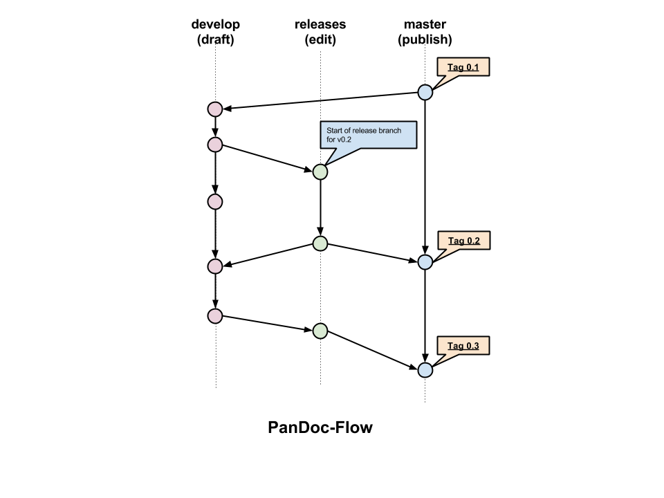

# Contributing

## Git Conventions

The Agile Software Development book repository uses a light version of the [git-flow](http://nvie.com/posts/a-successful-git-branching-model/) process to track changes.

We use only 3 types of branches: develop, releases (optional), and master.

### Master branch (publish)

The master branch should be used only for publishing new content that have been copy edited in a release branch.

### Releases branch (edit)

The releases branches are spanned from the develop branch when the content is ready to by copy-edited. No big changes (new section, chapter, and such) should happen in this branch, only fixes to grammar, syntax, typos. When the text is ready to be published, you should merge your changes in the master branch and apply a tag corresponding to the version you worked on. You must also synchronize the develop branch so you have the latest source code.

Releases branches are useful if you have a copy editor (or a team of copy editors), but you can also choose to make all your changes in the develop branch for simplicity.

### Develop branch (draft)

Most of the writing efforts should happen in this branch. All releases branches should be created from this branch and not from the master branch.

## Sending a Pull Request

* Be careful to use UTF-8 encoding in your files.
* Do not mix changes to the original English with translations in a single pull request.
* If your pull request changes a translation, prefix your pull request and commits' messages with the ISO 639 code, e.g. [de] Update chapter 2.
* Make sure the translation changes can be automatically merged. The maintainers can not make the merge manually if there are some conflicts (we are not polyglot yet).
* Make as sure as possible that the changes work correctly for publishing to PDF, ebooks and the book website.

## Translation

If you wish to translate the book, your work will be put up on the agiledroid.com site. Please put your translation into the appropriate subdirectory of this project, using the [ISO 639-1 code](https://en.wikipedia.org/wiki/List_of_ISO_639-1_codes) and send a pull request.

A maintainer will then make sure that the Makefile and the build system publish correctly your translation on the website.

To build locally your translation, you should change the default value of the *L10N* environment variable.  For example, for French, you will have:

	# Set language for build
	ifndef L10N
		L10N=fr
	endif
	
	
## Suggested Text Editor

The choice of a text editor (or IDE) by a software developer is very subjective, and is based on personal preferences. For this book, I used [GhostWriter](https://github.com/wereturtle/ghostwriter) as my text editor of choice. It is simple enough, lightweight, have nice markdown text highlighting, support basic spell checking, and it stays out of my way while I'm writing.

I have tried SublimeText, obscure IntelliJ IDEAS plugins, GEdit, VIM, and more but *GhostWriter* is the only markdown-oriented text editor I found that meet my needs.

Your mileage may vary, but you should give it a try!

      